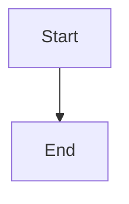

# Docs Site Skill

Manage the Crosswalker documentation site built with Astro Starlight.

## Quick Reference

| Command | What it does |
|---------|-------------|
| `cd docs && bun run dev` | Dev server with hot reload |
| `cd docs && bun run build` | Production build to `dist/` |
| `cd docs && bun run preview` | Preview production build locally |
| `cd docs && bun run test:local` | Run Playwright tests |

## Tech Stack

| Layer | Technology | Version |
|-------|-----------|---------|
| Framework | Astro | 6.x |
| Docs theme | Starlight | 0.38.x |
| Visual theme | starlight-theme-nova | Top nav, modern layout |
| CSS | Tailwind CSS v4 | Via `@tailwindcss/vite` |
| Styling | Custom brand.css | Cyber dark palette |

## Installed Plugins

| Plugin | Purpose |
|--------|---------|
| `starlight-theme-nova` | Top nav bar, modern layout |
| `@pasqal-io/starlight-client-mermaid` | Mermaid diagram rendering |
| `starlight-site-graph` | Obsidian-style graph view + backlinks |
| `starlight-blog` | Blog/changelog section |
| `starlight-announcement` | Dismissible announcement banners |
| `starlight-image-zoom` | Click-to-zoom images |
| `starlight-heading-badges` | Badge labels on headings |
| `starlight-sidebar-topics` | Multi-topic sidebar organization |
| `remark-obsidian-callout` | Obsidian `> [!note]` callout syntax |
| `remark-wiki-link` | Obsidian `[[wikilink]]` syntax |
| `rehype-external-links` | External links open in new tab |

## Directory Structure

```
docs/
├── astro.config.mjs          # Main config (plugins, sidebar, nav)
├── package.json               # Dependencies
├── playwright.config.ts       # E2E test config
├── tsconfig.json
├── tests/                     # Playwright tests
│   ├── smoke.spec.ts
│   └── deployment.spec.ts
└── src/
    ├── content.config.ts      # Content collection + schema
    ├── styles/
    │   ├── global.css         # Tailwind + Nova source scanning
    │   └── brand.css          # Cyber theme colors + callout CSS
    └── content/docs/
        ├── index.mdx          # Landing page (splash template)
        ├── getting-started/   # Installation, quick start
        ├── features/          # Import wizard, config, generation
        ├── concepts/          # Problem, ecosystem, terminology
        ├── design/            # Architecture, transformation, config
        ├── agent-context/     # Dev knowledge, decisions, exploration
        ├── development/       # Setup, testing, contributing
        ├── reference/         # Settings, commands, roadmap
        └── blog/              # Changelog/release posts
```

## Adding a New Page

1. Create `docs/src/content/docs/<section>/<slug>.mdx`
2. Add frontmatter:
```yaml
---
title: My page title
description: Brief description for SEO and sidebar.
---
```
3. The page auto-appears in the sidebar (sections use `autogenerate`)
4. Build and test: `bun run build && bun run test:local`

## Adding a Blog/Changelog Post

1. Create `docs/src/content/docs/blog/<slug>.mdx`
2. Frontmatter must include `date`:
```yaml
---
title: "v0.2.0 — Feature name"
date: 2026-05-01
---
```
3. Post appears at `/Crosswalker/blog/<slug>/`

## Obsidian-Flavored Markdown

These syntaxes work in `.mdx` files thanks to remark plugins:

```markdown
> [!note] Title
> Callout content renders as styled box

> [!warning]
> Warning callout

[[other-page]]  → renders as a link (if configured)
```

## Mermaid Diagrams

Standard fenced code blocks work:

````markdown

````

## Heading Badges

Add inline badges to headings:

```markdown
## My Feature :badge[New]
## Deprecated API :badge[Deprecated]{variant=caution}
```

## Theme Customization

**Colors**: Edit `docs/src/styles/brand.css` — uses Starlight CSS custom properties:
- `--sl-color-accent` — primary accent (currently cyan `#00d4aa`)
- `--sl-color-gray-*` — background/text grays
- `--sl-color-black` — darkest background

**Tailwind**: The `global.css` must include `@source` directives for any component directories that use Tailwind utility classes:
```css
@import 'tailwindcss';
@source '../../node_modules/starlight-theme-nova/src';
```

**Nova nav**: Edit the `nav` array in `astro.config.mjs` under the Nova plugin config.

## Deployment

- **Auto-deploys** on push to `main` when `docs/**` changes
- **Workflow**: `.github/workflows/deploy-docs.yml`
- **Requires**: Node.js 22+ (Astro 6 requirement)
- **URL**: https://cybersader.github.io/Crosswalker/

### Verify deployment
```bash
cd docs && TEST_URL=https://cybersader.github.io bun run test:deploy
```

## Troubleshooting

| Issue | Fix |
|-------|-----|
| `z.url is not a function` | Zod version mismatch — check Astro/Starlight versions are compatible |
| Tailwind classes not applied | Ensure `@source` in `global.css` points to Nova component dirs |
| 404 on GitHub Pages | Check `base: '/Crosswalker'` in astro.config.mjs |
| Mermaid not rendering | Check `starlightClientMermaid()` is in plugins array |
| Build needs Node 22+ | Astro 6 requires Node.js >= 22.12.0 |
