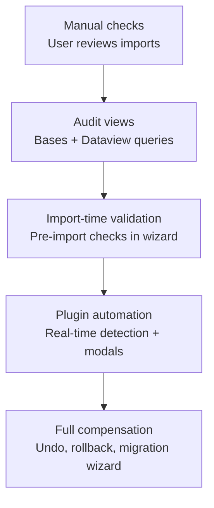

## The referential integrity gap

Obsidian vaults have no foreign keys, no cascade deletes, no schema validation on write. When Crosswalker generates 500 interconnected notes, nothing prevents a user from deleting one and leaving broken WikiLinks everywhere. This is the fundamental constraint of [file-based graph databases](/crosswalker/concepts/file-based-graph-database/).

Understanding constraint enforcement strategies helps Crosswalker design for resilience rather than hoping for perfect consistency.

## Types of integrity violations

| Type | Definition | Example |
|------|-----------|---------|
| **Dangling reference** | Link points to non-existent file | `related:: [[Deleted-Control]]` |
| **Orphan record** | File exists with no incoming references | A control note that nothing links to |
| **Stale reference** | Link points to correct file but data is outdated | Crosswalk link to old framework version |
| **Asymmetric relationship** | A references B but B doesn't reference A back | Forward link exists, backlink missing |

## Enforcement strategies

### Eager enforcement (prevent)

Validate constraints **before** allowing operations. Block invalid states.

| Approach | Example | Feasibility |
|----------|---------|-------------|
| Pre-import validation | Check all referenced files exist before generating | Easy — current Crosswalker behavior |
| Schema validation | Reject notes with invalid `_crosswalker` metadata | Easy — at generation time |
| Pre-delete hooks | Warn before deleting a note with inbound links | Requires plugin — scripts can't intercept |
| Interactive modals | "This control has 5 evidence links. Delete anyway?" | Requires plugin |

**Limitation**: Scripts and import wizards can only enforce eagerly at import time. User actions in the vault (delete, rename, move) cannot be intercepted without a plugin.

### Lazy enforcement (detect)

Allow operations, **then audit** for violations periodically.

| Approach | Example | Complexity |
|----------|---------|-----------|
| Post-import scan | Flag notes with broken WikiLinks after re-import | Medium |
| Scheduled audit | Periodic script checking all `_crosswalker` notes | Medium |
| Bases views | `.base` file showing notes with stale `import_date` | Low |
| Backlink analysis | Find framework notes with zero backlinks (unused) | Low |

**Obsidian Bases for lazy detection:**
```yaml
# Bases can detect flat property issues (tabular queries only)
filters:
  and:
    - file.inFolder("Frameworks")
    - 'file.backlinks.length == 0'
views:
  - type: table
    name: "Unused framework controls"
    order:
      - file.name
      - _crosswalker.import_date
```

> [!note] Bases limitation
> [Obsidian Bases](/crosswalker/concepts/metadata-ecosystem/) can only do tabular views of frontmatter properties. It cannot traverse typed links, check edge metadata, or do graph queries. Use DataviewJS or Datacore for relationship-level integrity checks.

### Compensating transactions (undo/repair)

Repair invalid states **after** they occur.

| Approach | Example | Complexity |
|----------|---------|-----------|
| Re-import | Regenerate all notes from source data | Low (destructive to user edits) |
| Link repair script | Find broken WikiLinks and remove/update them | Medium |
| Archive pattern | Move orphaned notes to `_archive/` instead of deleting | Low |
| ID aliasing | Add `aliases` frontmatter for renamed controls | Low |
| Deprecation marking | Set `_crosswalker.status: deprecated` | Low |

## Progressive enhancement path



| Phase | Enforcement | Capability |
|-------|------------|------------|
| **Current (0.1.x)** | Manual | User reviews generated output |
| **Near-term** | Lazy detection | Bases views for stale/orphaned notes |
| **Medium-term** | Import-time eager | Wizard validates before generating |
| **Long-term (plugin)** | Interactive eager | Modals for destructive actions |
| **Future** | Full compensation | Undo, rollback, migration wizard |

## Metadata tiers

Inspired by the DFD-Excalidraw project's progressive metadata approach, Crosswalker's `_crosswalker` metadata can be enriched in tiers:

### Tier 1: Minimal (current)

```yaml
_crosswalker:
  source_file: nist-800-53.csv
  import_date: 2026-04-02
  config_id: abc123
```

Enables: basic provenance, re-import detection.

### Tier 2: Standard (near-term)

```yaml
_crosswalker:
  source_file: nist-800-53.csv
  import_date: 2026-04-02
  config_id: abc123
  framework_version: "Rev 5 Update 1"
  source_hash: "a7b2f9c1"
  status: active  # active | deprecated | archived
```

Enables: version tracking, staleness detection, soft delete.

### Tier 3: Extended (medium-term)

```yaml
_crosswalker:
  # ... Tier 2 fields ...
  previous_ids: ["AC-2(old)"]
  schema_version: "crosswalker-v1"
  generated_by: "crosswalker-0.2.0"
```

Enables: ID aliasing, schema migration, tool version tracking.

### Tier 4: Temporal (future)

```yaml
_crosswalker:
  # ... Tier 3 fields ...
  history:
    - event: imported
      date: 2026-04-02
      source: nist-800-53-rev5.csv
    - event: re-imported
      date: 2026-10-15
      source: nist-800-53-rev5-update1.csv
      changes: [description_updated]
```

Enables: full audit trail, point-in-time queries, rollback. See [event sourcing in consistency models](/crosswalker/concepts/consistency-models/#event-sourcing-pattern).

## Orphan detection mechanisms

When frameworks update or notes are deleted, orphaned records accumulate. Four detection mechanisms with different performance characteristics:

| Mechanism | Algorithm | Performance | Detects |
|-----------|-----------|-------------|---------|
| **Forward scan** | For each note, verify linked targets exist | O(notes × links) | Dangling references |
| **Reverse scan** | For each note, verify sources reference back | O(notes × refs) | Stale references |
| **Reference counting** | Maintain `_ref_count` on each note | O(1) lookup | Orphans (count = 0) |
| **Graph traversal** | Walk entire graph, find disconnected components | O(nodes + edges) | All orphan types |

**Recommendation for Crosswalker:**
- **Tier 1**: Forward scan at import time (check generated links resolve)
- **Tier 2**: Bases views for backlink-count-based orphan detection
- **Tier 3**: Full graph traversal audit script (post-import validation)

## Schema versioning

Following the DFD-Excalidraw pattern of `dfd-asset-v1`, Crosswalker notes include a schema identifier in `_crosswalker` metadata. When the schema evolves:

1. New imports use the new schema version
2. Old notes retain their original schema version
3. A migration script can detect old versions and update them
4. [SchemaVer](/crosswalker/concepts/ontology-evolution/#schemaver-an-alternative-to-semver-for-data) (MODEL-REVISION-ADDITION) tracks compatibility

---

## Resources

### Database integrity theory
- Date, C.J. — "Database Design and Relational Theory" (O'Reilly)
- [Referential Integrity](https://en.wikipedia.org/wiki/Referential_integrity) — Wikipedia overview

### Related pages
- [Data model resilience](/crosswalker/agent-context/data-model-resilience/) — re-import strategies
- [Consistency models](/crosswalker/concepts/consistency-models/) — ACID, CAP, BASE
- [File-based graph databases](/crosswalker/concepts/file-based-graph-database/) — the data model
- [Framework versioning](/crosswalker/concepts/framework-versioning/) — what happens when frameworks update
- [Open questions](/crosswalker/agent-context/open-questions/) — unresolved design decisions
