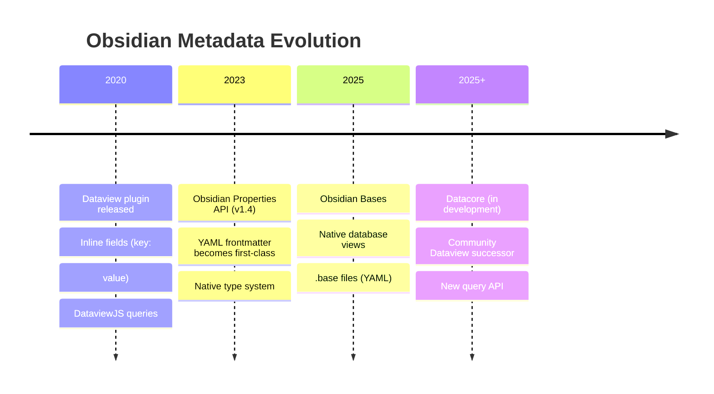

## The landscape is shifting

The way Obsidian handles structured metadata has changed significantly since Crosswalker's initial research phase. Understanding this evolution is critical for making the right design decisions about where to store data and how to query it.

## Timeline



## Properties API (native since Obsidian 1.4)

YAML frontmatter is now a **first-class citizen** in Obsidian with:
- **Type system**: text, number, date, checkbox, list, aliases, tags
- **Property editor**: visual UI for editing frontmatter
- **Global property registry**: consistent types across the vault
- **Search integration**: filter by property values

```yaml
---
control_id: AC-2
control_name: Account Management
framework: NIST-SP-800-53-r5
related_controls:
  - "[[AC-1]]"
  - "[[AC-3]]"
---
```

**Crosswalker implication**: All generated metadata should be YAML frontmatter properties. This is the most universally queryable format across all Obsidian tools.

## Dataview

The community plugin that pioneered structured queries in Obsidian.

**Key features:**
- **Inline fields**: `key:: value` syntax in note body (NOT frontmatter)
- **DQL**: SQL-like query language (`TABLE`, `LIST`, `TASK`, `CALENDAR`)
- **DataviewJS**: Full JavaScript queries with `dv.pages()`, `dv.table()`, etc.
- **Implicit metadata**: `file.name`, `file.ctime`, `file.tags`, etc.

**Current status**: No longer actively developed. The core developer has moved on. Still works, still widely used, but no new features or major fixes expected.

**What it can query:**
- YAML frontmatter properties
- Inline fields (`key:: value` in body text)
- File metadata (name, dates, tags, links)
- Computed values via DataviewJS

**What Crosswalker's link metadata syntax uses:**
```markdown
framework_here.applies_to:: [[AC-2]] {"sufficient": true}
```
This is a Dataview **inline field** with dot notation. Only Dataview (and potentially Datacore) can query this.

## Obsidian Bases

Native database-like views built into Obsidian. Uses `.base` files (YAML format).

**Key features:**
- **View types**: table, cards, list, map
- **Filters**: `file.hasTag()`, `file.inFolder()`, `file.hasLink()`, property comparisons
- **Formulas**: computed columns with date math, string functions, conditionals
- **Summaries**: sum, average, min, max, count, etc.
- **No plugin required**: built into Obsidian core

**Critical limitation: Bases is tabular only.** It provides flat views of notes matching filter criteria. It does NOT support:
- Graph or relationship traversal
- Inline field queries (only frontmatter properties)
- Nested/hierarchical views
- Edge metadata on links
- Aggregation across linked notes

**What Bases CAN do for Crosswalker:**
```yaml
# Show all NIST 800-53 controls missing evidence links
filters:
  and:
    - file.inFolder("Frameworks/NIST-800-53")
    - 'file.backlinks.length == 0'
views:
  - type: table
    name: "Controls without evidence"
    order:
      - file.name
      - control_id
      - control_name
```

**What Bases CANNOT do:**
- "Show all controls where the linking evidence has `sufficient: true`"
- "Traverse crosswalk links from CRI → CSF → 800-53"
- "Aggregate edge metadata across relationship chains"

These queries require DataviewJS or the future Datacore plugin.

## Datacore (in development)

Community successor to Dataview with a focus on performance and a modern API.

**Expected improvements:**
- Faster indexing (Rust-based)
- Better type system
- More expressive query language
- Potential inline field support (TBD)

**Current status**: In active development, not yet stable for production use. API may change.

**Crosswalker implication**: Monitor Datacore for when it reaches stability. It may become the recommended query layer for relationship traversal.

## Comparison matrix

| Feature | Properties (native) | Dataview | Bases (native) | Datacore |
|---------|:------------------:|:--------:|:--------------:|:--------:|
| **Frontmatter queries** | Read only | Full query | Full query + formulas | Full query |
| **Inline field queries** | No | Yes (`key:: value`) | No | TBD |
| **Graph traversal** | No | Via DataviewJS | No | TBD |
| **Edge metadata** | No | Via inline fields | No | TBD |
| **Table views** | No | `TABLE` queries | Native views | TBD |
| **Card views** | No | No | Native views | TBD |
| **Formulas** | No | DataviewJS | Native formulas | TBD |
| **Performance** | Instant | Slow on large vaults | Fast | Fast (Rust) |
| **Active development** | Yes | No | Yes | Yes |
| **Plugin required** | No | Yes | No | Yes |

## Impact on Crosswalker

### Frontmatter-first is the right default

All Crosswalker-generated metadata should be YAML frontmatter properties. This ensures compatibility with:
- Properties API (native editing)
- Obsidian Bases (tabular views, filters, formulas)
- Dataview (backward compatibility)
- Datacore (future compatibility)
- Obsidian search (property filters)

### Inline fields are for typed links only

The [link metadata syntax](/Crosswalker/agent-context/link-metadata-system/) (`framework_here.applies_to:: [[AC-2]] {"sufficient": true}`) uses Dataview inline fields because frontmatter cannot express per-link metadata. This is an intentional advanced feature with a known trade-off: only Dataview/DataviewJS (and potentially Datacore) can query it.

### Bases for compliance dashboards

Obsidian Bases is ideal for flat compliance views:
- "Which controls have no evidence?" (filter by backlink count)
- "Show all controls in the Access Control family" (filter by folder or property)
- "What was imported most recently?" (sort by `_crosswalker.import_date`)

But NOT for relationship queries:
- "What evidence supports this control with sufficient coverage?" (requires edge metadata traversal)
- "Show the full crosswalk chain from CRI to NIST to ATT&CK" (requires graph traversal)

### Migration path

For users with existing Dataview-based workflows:
1. **Keep Dataview** for relationship queries and inline field access
2. **Use Bases** for property-based views and dashboards
3. **Watch Datacore** for when it can replace Dataview
4. **Generate frontmatter** for all non-link metadata (Crosswalker's current approach)

---

## Resources

### Obsidian native
- [Obsidian Properties](https://help.obsidian.md/Editing+and+formatting/Properties) — official docs
- [Bases Syntax](https://help.obsidian.md/bases/syntax) — filter, formula, and view syntax
- [Bases Functions](https://help.obsidian.md/bases/functions) — complete function reference

### Community plugins
- [Dataview Documentation](https://blacksmithgu.github.io/obsidian-dataview/) — query language and API
- [Datacore GitHub](https://github.com/blacksmithgu/datacore) — Dataview successor (in development)

### Related pages
- [Link metadata system](/Crosswalker/agent-context/link-metadata-system/) — how typed links work
- [Link metadata syntax spec](/Crosswalker/agent-context/link-metadata-syntax-spec/) — full syntax reference
- [Ecosystem](/Crosswalker/concepts/ecosystem/) — where Crosswalker fits
- [Tradeoffs](/Crosswalker/agent-context/tradeoffs/) — design decisions
