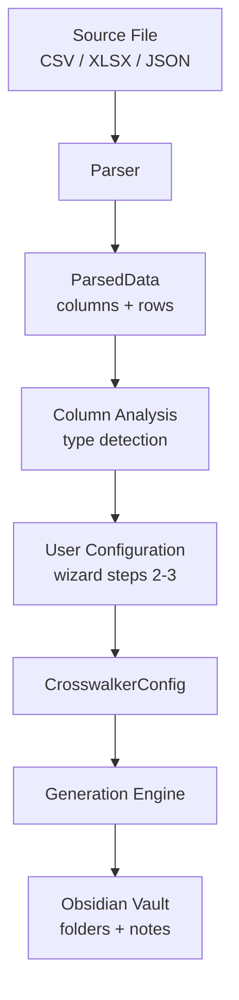

For the high-level lifecycle (Acquire → Import → Enrich → Maintain → Share), see **[Ontology lifecycle](/crosswalker/concepts/ontology-lifecycle/)** — the core architectural model that everything else maps to.

## Data flow



## Components

### Import engine (`src/import/`)
- **[Import wizard](/crosswalker/features/import-wizard/)** — 4-step modal UI built on Obsidian's `Modal` class
- **CSV parser** — PapaParse with streaming for files >5MB
- **XLSX parser** — Planned (xlsx package installed)
- **JSON parser** — Planned

### Generation engine (`src/generation/`)
- Creates folder hierarchy from hierarchy columns
- Generates markdown notes with YAML frontmatter
- Handles key naming transforms (snake_case, camelCase, etc.)
- Tracks imports via `_crosswalker` metadata

### Config system (`src/config/`)
- **[Config manager](/crosswalker/features/config-system/)** — Save, load, fingerprint, and match configurations
- **Config browser** — Modal UI for browsing and managing saved configs

### Settings (`src/settings/`)
- Plugin settings with defaults
- Settings tab UI with progressive disclosure

## File structure

```
src/
├── main.ts                      # Plugin entry, registers commands
├── import/
│   ├── import-wizard.ts         # 4-step modal workflow
│   └── parsers/
│       └── csv-parser.ts        # PapaParse streaming parser
├── generation/
│   └── generation-engine.ts     # Folder + note creation
├── config/
│   ├── config-manager.ts        # Save/load/match configs
│   └── config-browser-modal.ts  # Browse/select/delete UI
├── settings/
│   ├── settings-data.ts         # Interface + defaults
│   └── settings-tab.ts          # Settings UI
├── types/
│   └── config.ts                # TypeScript interfaces
└── utils/
    └── debug.ts                 # Debug logging
```
